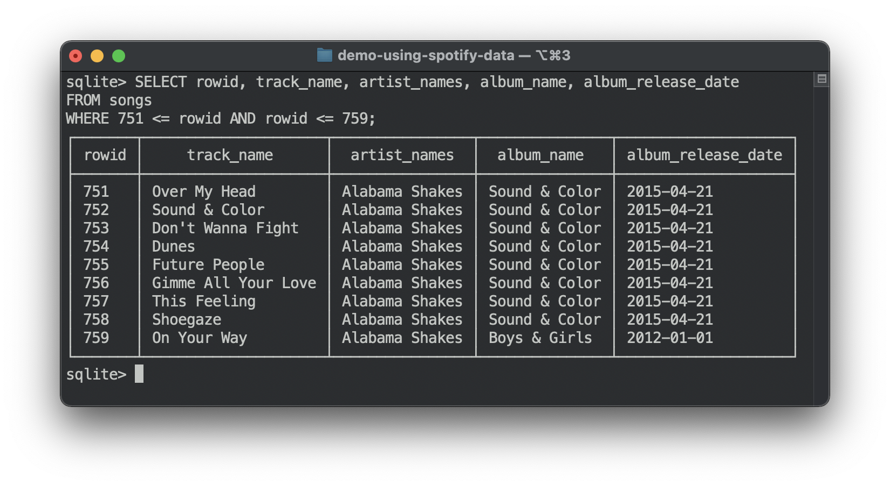
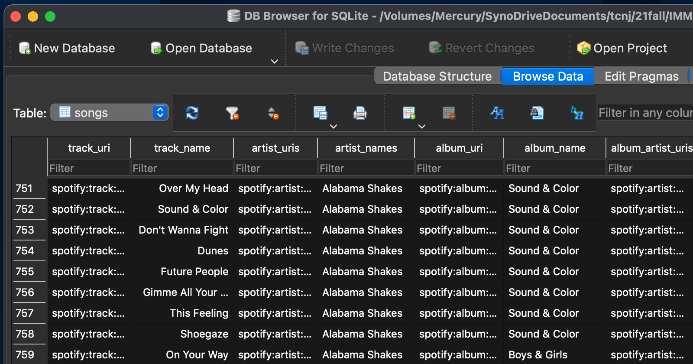
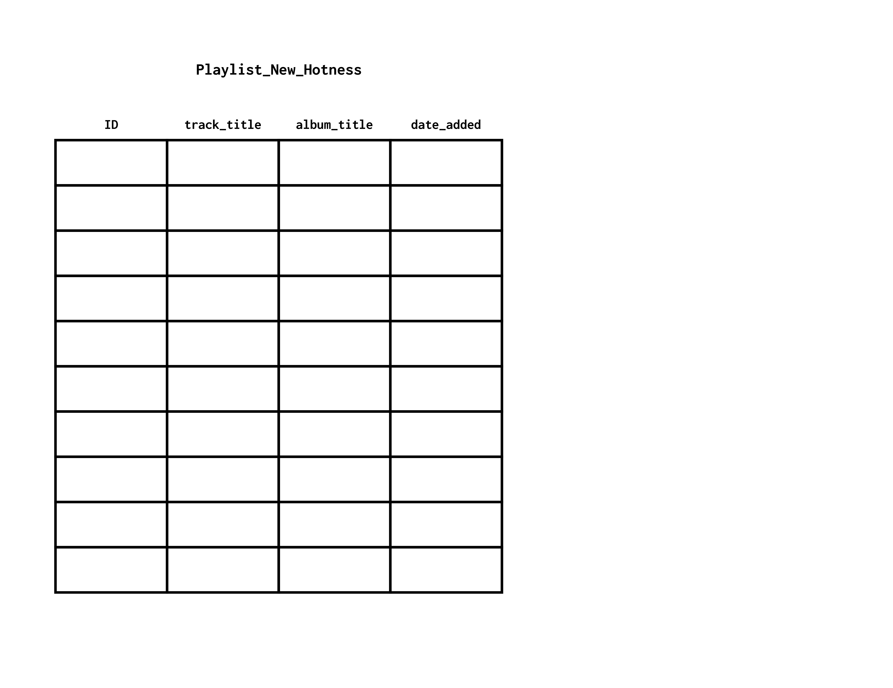
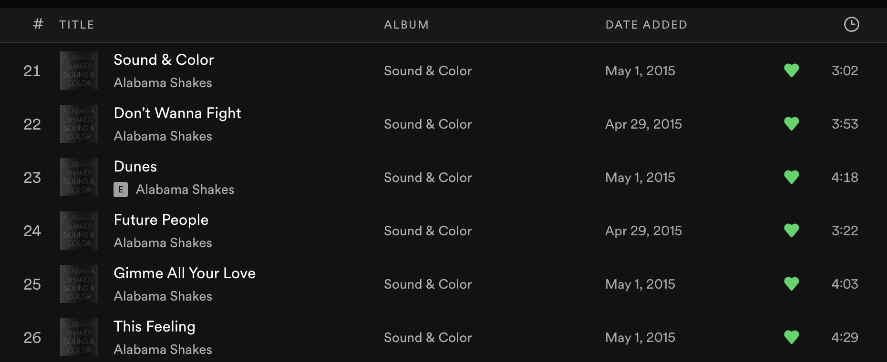
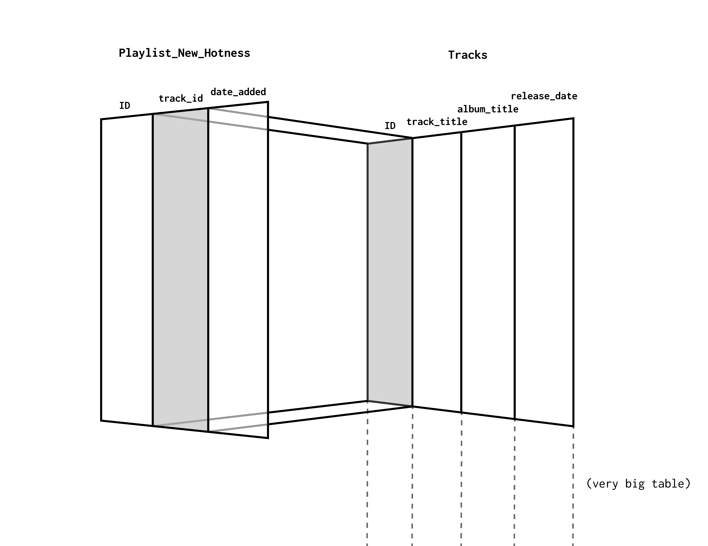
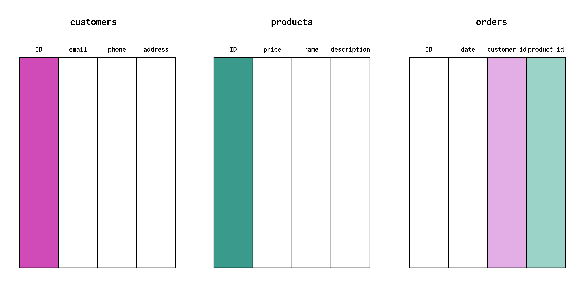
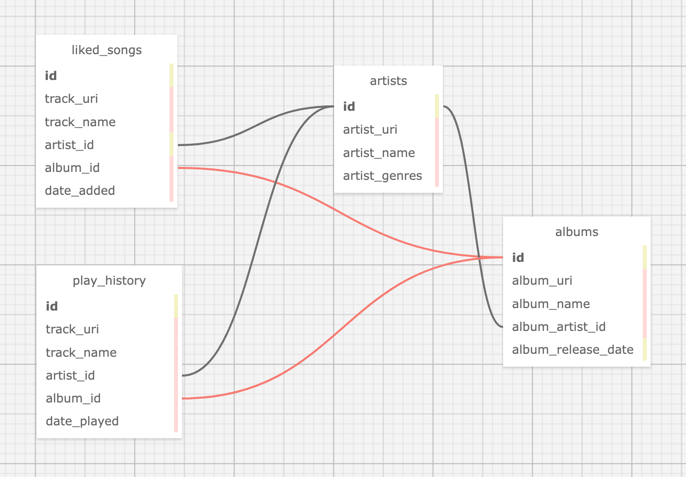

# Databases

## Outcomes

- Understand what databases are used for in the context of web applications
- Understand what characteristics databases are optimized for, as opposed to other data formats like csv


## Topic Notes

This serves as an relatively brief introduction to an incredibly large topic, as usual. 🙃

Databases are far and away the best method for storing data in your web applications. They persist across restarts of your server and application, and they have several advantages over regular plain text files like CSV and JSON.


### Databases Are Special Files

Databases are essentially a type of file, and in a lot of ways they're similar to a spreadsheet. They have tables with columns and rows of data. Databases can store almost any kind of data in these tables - from numbers and text, to images and other kinds of files.

One major difference with databases compared to regular files is that we don't interact with them in the same way that we open and edit typical files like spreadsheets, graphics, or plain text.



To retrieve and update data in a database, we "talk to" the database using a language called **S**tructured **Q**uery **L**anguage (SQL). SQL allows us to ask the database to look up and format the exact information we're looking for in very expressive ways.

```
SELECT popularity, track_name, artist_names
FROM songs
ORDER BY popularity DESC
LIMIT 20;
```

Because they are capable of holding vast amounts of data, with pieces linked together in different ways, it's difficult to look at the data in a *single* flat view, like a csv file or spreadsheet. (In some cases your computer may not even have enough memory to display everything at once!)

This feels cumbersome to beginners. It's hard to know what to ask the database for without being able to easily see what's in it. There are GUI applications for that help to make things a little easier.




### Databases Can Be Very Strict about Data Types

Most database management systems (DBMS) like MySQL, PostgreSQL, etc, are very strict about the types of data you plan to store in each column of your tables. Each column in your tables has a specific data type, format, and even length.

(To give you an idea, here are the data types for [SQLite](https://www.sqlite.org/datatype3.html#affinity_name_examples) and [MySQL](https://dev.mysql.com/doc/refman/8.0/en/data-types.html).)


Why does the database need to know so much about the data all the way down to the character length of a given column?


- So it knows *exactly* how much disk space to allocate per entry
- So it can *very quickly* jump to a given starting point and begin reading data byte by byte


### Databases Are Designed for Things Other than User Friendliness

You may be thinking...

"I have to write a SQL query just to look at a table?"

"I need weird commands just to update a record?"

"Why do the data types matter so much?"

These inconveniences make a lot more sense when you keep in mind that databases are not designed primarily for user friendliness. **Instead, they are designed around other goals:**

- **Efficiency**
- **Scale**
- **Data Integrity**

Spreadsheets and plain text files are undoubtedly easier for humans to work with, but once you have millions of records and many clients trying to access at once, things break down pretty quickly.

Always keep these design goals in mind when learning about and working with databases.

Databases are meant to *scale* up to millions of records while maintaining blazing fast indexing, searching, and *efficiency*, all while guaranteeing *data integrity*, ensuring nothing gets corrupted even with many simultaneous connections.

Text files, spreadsheets, and even regular filesystems are not as good at these things.


### Databases Use Relationships

All SQL-based databases are called *relational* databases. Data is broken down and stored across multiple tables that are linked together.

Let's look at an example. Pretend this is a playlist on Spotify:



Every item in a database table has a unique `ID`. Here we can pretend this matches the order of the items in the playlist. ID 1 is the first song in the list, ID 2 appears second, etc.

Then we have columns for `track_title`, `album_title`, and the date the track was added to our playlist.

This is pretty much exactly how a playlist *looks* when you view it in Spotify, but it's not how the data is actually stored.



Think about this: Spotify has millions of songs and millions of users. How many duplicate copies of the same `track_title` and `album_title` would there be if this is how the data was stored on Spotify's servers?

You can imagine how quickly this becomes an incredible waste of space. And while music data doesn't change much after its published, imagine what would happen if the title of a song theoretically changed? You'd have to find and update the `track_title` everywhere it appears in every playlist!

Instead, data that would be duplicated is extracted into a separate table, and a reference link is created between the two tables:



This link is called a *foreign key*.

The `Tracks` table is absolutely huge, yes, but every track's title and album is only stored once, and can be referenced from everywhere else. Overall this is a much, much more efficient way to store the data.

This process of deduplicating and linking unique pieces of data is called *normalization*.

Here's another example - a simple company that tracks customers, products, and orders:



- The `customers` table is a list of contact info for everyone with an account.
- The `products` table contains the company's product catalog.
- The `orders` table is a list of receipts.

Invoices generated for orders may reference the `customers` table to fill in a header with contact info.

The website's product list may reference the `products` table to generate an html page with current prices and descriptions.

The `orders` table makes the company's accounting very easy, and instead of including customer and product info with every order, that information is linked to the other tables.

Normalization and linking tables is a core part of relational database design. As such, SQL GUI applications often support a special type of diagram used to help visualize the relationships between tables. This is called an Entity-Relationship or ER diagram:


