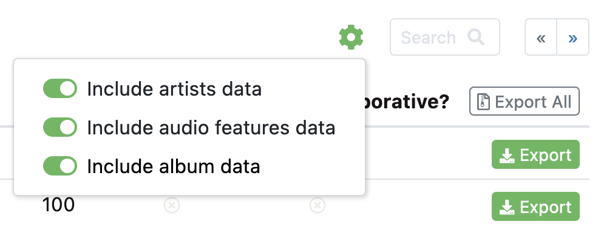

# SQLite (vs. Other Databases)

SQLite is an extremely popular type of database, especially for embedded or native applications.

Your browser most likely stores history and bookmarks in an SQLite database. Your text messages and iMessages are most likely stored in an SQLite database. Lightroom photo catalogs are SQLite databases.

Features of SQLite:

- SQLite databases are self-contained files that are easy to copy and manage like regular files. Most other databases are a little more complicated.
- SQLite is "lightweight" and extremely performant.
- SQLite has fewer data types and is a bit simpler than most other DBMS.
- SQLite does not have a client-server model like most other DBMS.

This last feature is why SQLite is also very popular for local development of web applications.

Most other database management systems (DBMS) use a client-server model, which is better for deployment on the web, but is necessarily more complicated to set up.

It's very common for developers to use SQLite for its simplicity when developing, and deploy their application with a different kind of database on the server.

The most popular relational databases used on the web that work on a client-server model are MySQL, its "sister" MariaDB, and PostgreSQL.


## SQLite Demo

Let's create an SQLite database and run some queries to get a feel for how databases work!

<!-- We will most likely be using a Python package called SQLAlchemy for creating and managing the database in your web applications, but some practical experience working directly with SQL and databases is really valuable. -->


### Steps

Here are the demo steps we'll complete together.

- Install `sqlite3` as needed (Check what version is pre-installed on macOS and Ubuntu?)
- Optional: Install [DB Browser for SQLite](https://sqlitebrowser.org/) for a GUI
- Create a folder in your web2 course folder for `sqlite-demo`, or similar.
- Use [Exportify](https://watsonbox.github.io/exportify/) to download a csv of your "Liked" playlist. This should be all of the songs saved to your library. Two things to note during this step:

    - Click the settings gear to include all possible additional data.
    
      
    
    - Only click the Export button once. The page has no loading indicator, and long playlists take some time to assemble. (If you check the dev tools you'll see that it is in fact working in the background.)
    
      
    
- Upload your csv file(s) to the Google Drive demo folder where I can grab them and process everything.
- Brandon: Quicklook my csv to see the data
- Brandon: BBEdit add the `username` column to each csv file
- Pull up the [pdf in Google drive](https://drive.google.com/open?id=1lSZ8YZeDMvUGMdxg9vaKlmcHY8d2s1Gh&usp=drive_fs) to see column names, data types, and example data
- Check out the Spotify API reference on [audio track features](https://developer.spotify.com/documentation/web-api/reference/#/operations/get-audio-features) to better understand what some of the columns mean
- Brandon: Add a `username` column to each csv file. Just use first names. (BBEdit find `^` replace `"username",`)
- Brandon: Add the input files to the `create-db.sql` script
- Brandon: Create the database and upload it to Google Drive for everyone to download and follow along
- Run some queries!


### Example Queries

Open the database and tell sqlite to print things nicely:

```bash
$ sqlite3 spotify-data.db
sqlite> .headers on
sqlite> .mode table
```

*(Note: These queries apply for everyone. We'll have to add WHERE clauses or otherwise alter them to work for specific users.)*

SQL `SELECT` statements are structured like this:

```
SELECT items you want to get
FROM table(s) the data is found in
WHERE limitations and filters (e.g. LIKE '%search term%')
ORDER BY the sort order for results (e.g. DESC/ASC)
LIMIT number of results if the list is super long
```

Capitalization doesn't matter in the SQL syntax, but capitalizing the keywords is a strong convention.

You should be able to use single or double quotes, but to be safe (and for marginally easier typing) use single quotes everywhere.

Let's get the top 20 most popular songs on Spotify that are in our shared library:

```
SELECT popularity, track_name, artist_names FROM songs ORDER BY popularity DESC LIMIT 20;
```

How about a count of the number of songs added per year:

```
SELECT COUNT(strftime('%Y', added_at)) as 'songs added', strftime('%Y', added_at) as 'added year' FROM songs GROUP BY strftime('%Y', added_at);
```

See if you can find all the occurrences of a given song or artist. What columns do we want?

<!-- 
Look up a specific track name:

```
SELECT track_name, artist_names, album_name FROM songs WHERE track_name LIKE '%kryptonite%';
```
 -->

How about some stats on an a cappella track:
```
SELECT speechiness, acousticness, instrumentalness, energy, valence, danceability, track_name FROM songs WHERE track_name LIKE '%somewhere over the rainbow%EP%';
```

List the top 30 most liked artists:

```
SELECT COUNT(*) as 'number of liked songs', artist_names as 'artist' FROM songs GROUP BY artist_names ORDER BY COUNT(*) DESC LIMIT 30;
```

See if you can find *your* top 10 most liked artists.

Why so much Red Hot Chili Peppers (for me)? Duplicate albums? Let's find out:

```
SELECT track_name, album_name FROM songs WHERE artist_names LIKE '%red hot chili peppers%' ORDER BY track_name ASC;
```

...and a more complicated version with row numbers:

```
SELECT ROW_NUMBER() OVER (ORDER BY track_name) as rownum, track_name, album_name FROM songs WHERE artist_names LIKE '%red hot chili peppers%' ORDER BY track_name ASC;
```

What's our average "danceability"?

```
SELECT avg(danceability) FROM songs;
```

That's not very useful. Try that one again with a `GROUP BY` clause for usernames.
<!-- 

```
SELECT avg(danceability) FROM songs GROUP BY username;
SELECT avg(danceability), username FROM songs GROUP BY username;
SELECT avg(danceability), username FROM songs GROUP BY username ORDER BY avg(danceability) DESC;
```
 -->

```
SELECT max(danceability), artist_names FROM songs GROUP BY artist_names ORDER BY max(danceability) DESC LIMIT 20;
```

(We can check out some of the other metrics too, like speechiness and valence.)

Liked songs by release year:

```
SELECT COUNT(strftime('%Y', album_release_date)) as 'total albums released', strftime('%Y', album_release_date) as 'release year' FROM songs GROUP BY strftime('%Y', album_release_date);
```

What's up with the '-4707' conversion?

```
SELECT album_release_date FROM songs WHERE strftime('%Y', album_release_date) = '-4707';
```

...some albums only have the release year, not the full date.

Rather than trying to convert the dates, just use a substring to get the year:

```
SELECT COUNT(substr(album_release_date, 0, 5)) as 'albums released', substr(album_release_date, 0, 5) as 'release year' FROM songs GROUP BY substr(album_release_date, 0, 5);
```

Ordered by number of albums released:

```
SELECT COUNT(substr(album_release_date, 0, 5)) as 'albums released', substr(album_release_date, 0, 5) as 'release year' FROM songs GROUP BY substr(album_release_date, 0, 5) ORDER BY COUNT(substr(album_release_date, 0, 5)) DESC
```

### Wrap-up Discussion

Don't forget we didn't do any normalization. I skipped normalizing any of the data for our demo because it takes time, and makes the queries a bit more complicated. How many times does the same artist appear in our database?

```
SELECT artist_names FROM songs WHERE artist_names LIKE '%taylor swift%';
```

This is really inefficient from a storage and management perspective. Wasted bytes to store many copies of the same data. Slow and inconvenient to update all of these matching records.

We wrote a bunch of queries to retrieve data, but updating the database is done in a very similar way. We use an `UPDATE` statement instead of `SELECT`.

In applications like our web apps, we figure out the query we need to run, and program the application to run the query and process the results. We can even interleave variables with the SQL syntax. For example, inserting a user's search term from an HTML form into a `SELECT` statement.

Here's a barebones SQLite query through python:

```python3
import sqlite3

con = sqlite3.connect("./spotify-data.db")
cur = con.cursor()
with con:
    avg_dance_by_user = cur.execute("""
        SELECT avg(danceability),
               username
        FROM   songs
        GROUP  BY username
        ORDER  BY avg(danceability) DESC;  
        """)
for dancer in avg_dance_by_user.fetchall():
    print(dancer)
con.close()
```


### SQLite Documentation Links

- [Documentation](https://www.sqlite.org/docs.html)
- [Command Line Shell for SQLite](https://www.sqlite.org/cli.html)
- [Date And Time Functions](https://www.sqlite.org/lang_datefunc.html)
- [SELECT](https://www.sqlite.org/lang_select.html)
- [Built-in Aggregate Functions](https://www.sqlite.org/lang_aggfunc.html)
- [Built-In Scalar SQL Functions](https://www.sqlite.org/lang_corefunc.html)
- [SQL As Understood By SQLite](https://www.sqlite.org/lang.html)
- [Datatypes In SQLite Version 3](https://www.sqlite.org/datatype3.html)
- [CREATE TABLE](https://www.sqlite.org/lang_createtable.html)
- [PRAGMA Statements - table_info](https://www.sqlite.org/pragma.html#pragma_table_info)


### SQLite Functions Quick Reference

Inspect a table's structure:

- `PRAGMA index_info('songs');`

Built-in Aggregate Functions

- `avg(X)`
- `count(*)`
- `count(X)`
- `group_concat(X)`
- `group_concat(X,Y)`
- `max(X)`
- `min(X)`
- `sum(X)`
- `total(X)`

Built-In Scalar Functions

- `substr(string, index, length)`
- `round()`
- `trim()`, `ltrim()`, `rtrim()`


Dot Commands (SQLite CLI interface)

Run `.help` to see the full list

- .headers on|off
- .mode box|column|csv|html|json|line|list|markdown|table|tabs
- .timer on|off
- .separator "\t"
- .stats
- .schema
- .read?
- .import?
- .explain TABLE
- .width COL1 COL2...
- .help PATTERN


## Resources

- Spotify API reference on [audio track features](https://developer.spotify.com/documentation/web-api/reference/#/operations/get-audio-features)

### SQLite GUI Applications

There are lots of graphical applications for managing databases, especially for MySQL. Most let you query, edit data and table structures, import/export, and more.

Here are some of the most popular, *free*, cross-platform database GUI's I'm aware of for working with SQLite:

- [DB Browser for SQLite ("sqlitebrowser")](https://sqlitebrowser.org/) - simple, popular
- [SQLiteStudio](https://sqlitestudio.pl/)
- [DBeaver community edition](https://dbeaver.io/) - handles multiple kinds of dbms, including MySQL, etc.


### Further Reading

- [Love Your Spotify, Apple Music Recommendations? Thank a Pandora Music Analyst](https://www.pcmag.com/news/love-your-spotify-apple-music-recommendations-thank-a-pandora-music-analyst) (2020)
- [SQLite3 command line: how do you cancel a command?](https://unix.stackexchange.com/questions/291083/sqlite3-command-line-how-do-you-cancel-a-command)
- [XKCD 327 Exploits of a Mom](https://xkcd.com/327/)


