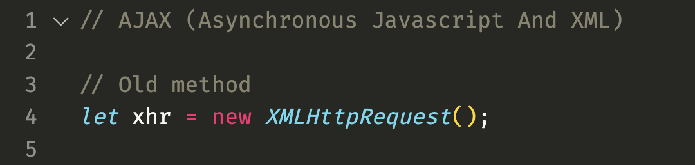
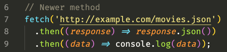
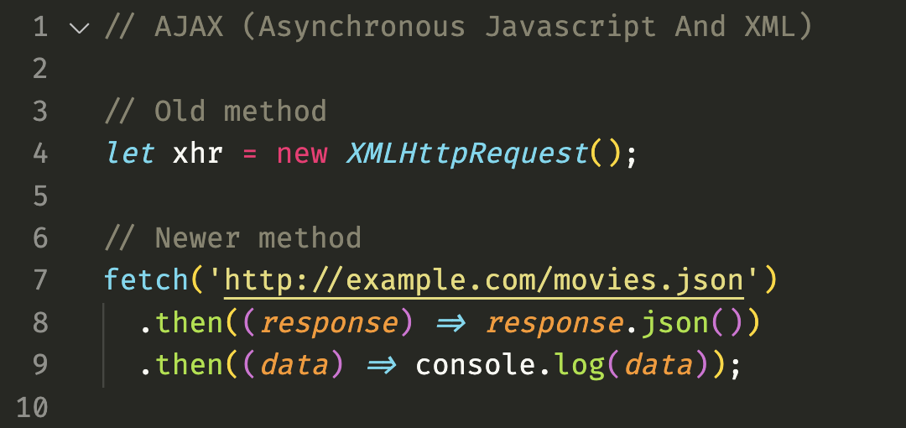

# Dynamic Websites

At its heart the web is a document store... a distributed network of computers where anyone can post information (web pages) and anyone else can access it. Client browsers request urls, servers send back files, browsers display them (with css and sparkles).


## Client and Server Roles

What makes a server a server? and a client a client?

What do you imagine when you think of servers?


(A hallway of racks with network patch cables in a sterile, air-conditioned facility.)

Well, that's mostly true. Servers are often a purpose built type of computer. Just like your gaming PC might have a beefy graphics card and rgb lights worth +2HP, purpose built servers have really fast internet connections and no graphics at all. The hardware is spec'd to what they're being used for.


But being a server or a client is more about role playing than inherent being. It's as much about the software running on the computer as the hardware components.


**Almost any internet connected computer can play the role of a server.** That includes your own computer and even, for better or worse, a wifi connected washing machine.


So what makes a computer a server? In short:

- Internet connection - hopefully a good one!
- A server application - software that listens for and responds to requests on the network

Technically optional are a screen, mouse, and keyboard. Servers can often be managed entirely from the terminal!


## Client-Server Communication

So dynamic websites require a client to make requests, and a server to generate the pages and respond to them.

But how do they communicate?


## HTTP

**H**yper **T**ext **T**ransfer **P**rotocol is the predominant form of communication on the internet.

Computers can communicate across a network using a bunch of different dialects. HTTP is one. FTP is another. It's kind of like a phone call vs a text message.


## HTTP Characteristics

- HTTP has methods
- HTTP has headers
- HTTP has [status codes](https://http.cat/)

Client:
```
GET http://example.com/

user-agent: Firefox v106
compression: gzip is cool
```

Server:
```
status: 200 OK
compression: gzip

<!doctype html><html>...
```
(not real code)

- HTTP has methods: GET POST PUT PATCH DELETE. GET and POST are the most common.
- HTTP has headers: Information that the server or client needs to handle things
- HTTP has status codes: Every HTTP response includes a status code, telling the client what happened. There are a bunch of status codes but some of the more common are 200 OK, 301 Permanently Moved, and 404 Not Found.


## Static vs Dynamic

Static websites are just documents.

Dynamic websites have data that may change.

- Let's talk about what makes a website static vs dynamic, starting with the terms.
- Define the terms static and dynamic.
- What's the key difference? Whether things change.
- Static websites are just documents. They may have animations or other visual flourishes, but the content is the same every time you request a page.
- Static pages can be viewed offline and without a server. When deployed, the server processes each request by simply sending back the files it has on disk.
- Dynamic websites have data that may change. For this reason, dynamic sites usually *require* a server, and at least part of the content is generated by the server on every request. The data may change at any time, so the pages have to update. For example: new posts and comments are added, product inventory is updated, etc.


## What Happens on the Server

- Dynamic websites have routing
- Dynamic websites process data
- Dynamic websites interface with data storage mechanisms (databases, files, etc)
- Dynamic websites use templates

- Routing: A url may not represent a file at all, but instead a script or piece of code that's associated with that url
- Data is processed: The application code will process the request, including any other data that came with it (like a form submission)
- Interface with data storage: Each request usually requires pulling or updating information from a database
- Use templates: Once the data is processed and/or retrieved, the application fills out an html template with the data and sends back a custom, one-off web page just for that request
- Generally, all of this happens *on every request*.


## Demo App

- Break to play with live demo
    - Open 3-up display: terminal fresh tab running dev server, names.py + index.html, names.txt
    - Step through and explain the 4 components in the previous slides, then come back.
    - Note the browser's still receiving regular, plain html
    - Talk about web1.brandon.courses and the templating feature this app doesn't use: partials/includes
        - Let's take a look at the web1 class website. I've got a persistent nav bar on every page. But there are 70+ pages on this website. If I wanted to change the nav bar I'd have to update it manually on every page?? That's ridiculous. Nobody does that.
        - Pretty much all templating languages have a feature called "includes" or "partials". This lets you break your html document up into chunks, in separate files.
        - Every lesson page on my class website has a little line at the very top that says `include nav.php`. This pulls in my one and only copy of the nav portion of the html. I update that file once, and all 70 or so pages on the class website are referencing that same navigation list.
- Dynamic web languages and frameworks
    - Many languages and frameworks can be used for handling requests like this. PHP, Ruby ("on rails"), occasionally Python, asp.NET, and yes, often times nowadays, JavaScript.
    - The tools and languages used vary widely but the result is the same—requests are received, processed, and what gets sent back is a standard HTTP response with a status code, some headers, and a bunch of data (plain text like HTML or JSON, binary data like image files, Javascripts, etc)


## Partial Page Loading

"Dynamic" on the backend refers to pages and data that are dynamically generated with each request, based on that request.

But websites can be dynamic on the frontend too, using a javascript feature called AJAX.




Asynchronous Javascript And Xml  
using XHR, or it's more modern alternative,





- The demo app generated up to date html with every request. That's great and all, but from a UX perspective there are many kinds of interactions where this is jarring. Imagine if the full page had to reload every time a user clicked a button or interacted with a form. It also wastes a bunch of time and data when most of the page is staying the same across requests, and a whole new page has to be sent back. That's where this technology called AJAX comes in.




- Javascript running in the client's browser can wait for certain kinds of interactions from the user, and ask for new *pieces of data* to replace *parts of the DOM*, instead of a whole page.
- (The term and especially this code aren't that important. It's just a way for javascript to make requests to the server without loading a whole new page.)


## Example Close-at-Hand

[Giphy Infinite Scrolling](https://giphy.com/search/dog-fetch)

- Open dev tools network tab while scrolling down
- Javascript watches for when you near the bottom of the page, sends a request for more images, then adds them to the DOM.
- The client and server are still communicating back and forth using HTTP, but instead of a fully rendered page, the server is just sending back some data for javascript to use.
- So we can dynamically get some data to fill in a div or a dialog or update a list. How far can we push this? How much of the page's information can be "dynamic" like this? Pretty much all of it, in fact...


## Single-Page Applications

At the far end of this spectrum between static pages, and dynamically updating content, we have Single Page Applications.

- [Google Maps](https://www.google.com/maps) (with dev tools network tab open)
- [Spotify](https://open.spotify.com/) (with js disabled)

What gets sent back from the server in this scenario is a hollow shell of HTML that's basically just one empty div. Javascript steps in to populate the entire html structure, and sends data back and forth to the server as users interact with different parts of the page. The entire "website" lives in a single page, with few or no full page loads required.

- Switch over to show these urls
- SPA's are fancy and frankly amazing, and they enable web applications to do incredible things, but there are some drawbacks.
- Accessibility, SEO, and complicated history state (back button functionality). Basically the fact that a url isn't always 1:1 with a consistent view of content. Also processing power and performance when you're doing everything on the client side.
- (Because going back to the beginning, at its heart the web is a document store... not an application platform. It wasn't originally designed to work this way.)


## APIs

With single page applications, the server doesn't use templates or send back much of anything that's ready to display. It just sends and receives raw data, and the client side is entirely responsible for receiving and handling the data, and creating and updating the HTML/UI using that data.

- Fade in diagram

In this scenario, the server side is an API.


By completely removing html and UI responsibilities from the server side code and business logic, the same server sending and receiving raw data can interact with multiple types of clients and UI's.

This is how the majority of modern cross-platform applications work.
